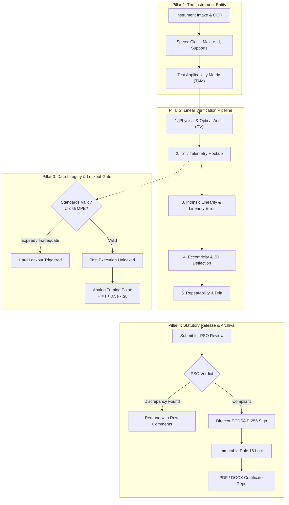

# METROLOGIX-76: Comprehensive UI Mental Model & Feature Inventory

> **Statutory Authority**: Department of Consumer Affairs (DoCA), Ministry of Consumer Affairs, Food & Public Distribution, Government of India  
> **Problem Statement ID**: 26035 — *Development of a Software Program/Application for Generation of Test Reports for Non-Automatic Weighing Instruments (NAWI) as per OIML Recommendation R 76*  
> **Applicable Standards**: Legal Metrology Act, 2009 · Legal Metrology (General) Rules, 2011 · OIML R 76-1:2006 · OIML R 76-2:2007 · OIML R 111-1 · WELMEC 7.2 · ISO/IEC 17025  

---

## Table of Contents
1. [Executive Summary & Problem Statement Traceability Matrix](#1-executive-summary--problem-statement-traceability-matrix)
2. [Core UI Mental Model Architecture](#2-core-ui-mental-model-architecture)
3. [User Personas & Statutory RBAC Boundaries](#3-user-personas--statutory-rbac-boundaries)
4. [Application Shell, Navigation & Global Controls](#4-application-shell-navigation--global-controls)
5. [Exhaustive Feature & Component Breakdown by View](#5-exhaustive-feature--component-breakdown-by-view)
   - [5.1 Authentication Portal (`LoginScreen.tsx`)](#51-authentication-portal-loginscreentsx)
   - [5.2 Main Lab Dashboard (`LabDashboard.tsx`)](#52-main-lab-dashboard-labdashboardtsx)
   - [5.3 Active Tests Workspace (`ActiveTestsWorkspace.tsx`)](#53-active-tests-workspace-activetestsworkspacetsx)
   - [5.4 Scale Bridge & IoT Telemetry Gateway (`LiveBridge.tsx`, `VirtualScaleSimulator.tsx`, `WelmecAuditPanel.tsx`)](#54-scale-bridge--iot-telemetry-gateway-livebridgetsx-virtualscalesimulatortsx-welmecauditpaneltsx)
   - [5.5 Instrument Intake & TAM Generator (`InstrumentIntakeForm.tsx`)](#55-instrument-intake--tam-generator-instrumentintakeformtsx)
   - [5.6 Test Scope Matrix (`TestScopeMatrix.tsx`)](#56-test-scope-matrix-testscopematrixtsx)
   - [5.7 Computer Vision & Optical Physical Audit (`PhysicalAuditorView.tsx`)](#57-computer-vision--optical-physical-audit-physicalauditorviewtsx)
   - [5.8 Clause A.4.4 Weighing Error Worksheet (`ObservationGrid.tsx`, `ErrorCorridorChart.tsx`)](#58-clause-a44-weighing-error-worksheet-observationgridtsx-errorcorridorcharttsx)
   - [5.9 Clause A.4.7 2D Platter Deflection Heatmap (`PlatterHeatmap.tsx`)](#59-clause-a47-2d-platter-deflection-heatmap-platterheatmaptx)
   - [5.10 Clause A.4.10 & A.4.8 Repeatability & Sensitivity (`RepeatabilityView.tsx`)](#510-clause-a410--a48-repeatability--sensitivity-repeatabilityviewtsx)
   - [5.11 Clause A.5.3 & A.4.6 Environmental Drift & Tare Testing (`TareTempView.tsx`)](#511-clause-a53--a46-environmental-drift--tare-testing-taretempviewtsx)
   - [5.12 Review Pipeline & Digital Signatures (`ReviewPipeline.tsx`, `ReviewerQueue.tsx`, `DirectorSignModal.tsx`, `GreenStampedSeal.tsx`, `RowLevelCommentDrawer.tsx`)](#512-review-pipeline--digital-signatures-reviewpipelinetsx-reviewerqueuetsx-directorsignmodaltsx-greenstampedsealtsx-rowlevelcommentdrawertsx)
   - [5.13 Reference Standard Weights & Hard Lockout (`traceability`, `LockoutBanner.tsx`)](#513-reference-standard-weights--hard-lockout-traceability-lockoutbannertsx)
   - [5.14 Legacy Excel Ingestion & "False Pass" Auditor (`ExcelIngestionView.tsx`)](#514-legacy-excel-ingestion--false-pass-auditor-excelingestionviewtsx)
   - [5.15 Cryptographic Immutable Audit Trail (`audit`)](#515-cryptographic-immutable-audit-trail-audit)
   - [5.16 OIML R 76-2 Certificates Repository (`ReportRepositoryView.tsx`, `downloadService.ts`)](#516-oiml-r-76-2-certificates-repository-reportrepositoryviewtsx-downloadservicets)
   - [5.17 Jury Presentation & Walkthrough Assistant (`JuryDemoAssistant.tsx`)](#517-jury-presentation--walkthrough-assistant-jurydemoassistanttsx)
6. [Mathematical Metrology & Calculation Formulas](#6-mathematical-metrology--calculation-formulas)
7. [Complete Component Catalog & Source Code Directory Mapping](#7-complete-component-catalog--source-code-directory-mapping)
8. [State Management Architecture & React Context Flow](#8-state-management-architecture--react-context-flow)
9. [UI/UX Mental Model Synthesis & Simplification Guidelines](#9-uiux-mental-model-synthesis--simplification-guidelines)

---

## 1. Executive Summary & Problem Statement Traceability Matrix

The SIH Problem Statement 26035 specifies 10 mandatory technical and operational requirements for evaluating Non-Automatic Weighing Instruments (NAWIs). The table below demonstrates how every single requirement from lines 17–41 of `docs/a.txt` is mapped to the implementation:

| Statutory Requirement (`docs/a.txt`) | Implementation Component(s) | Operational Feature & UI Capabilities |
| :--- | :--- | :--- |
| **1. Capturing instrument details & specs** | [`InstrumentIntakeForm.tsx`](file:///c:/Users/shash/OneDrive/Desktop/SIH35/frontend/src/features/intake/InstrumentIntakeForm.tsx) | 1-Click presets, Tesseract OCR for rating plates, Table 3 interval validator ($n = \text{Max}/e$), receptor geometry, support count, mobility, WELMEC 7.2 software audit fields. |
| **2. Recording lab & environmental conditions** | [`TareTempView.tsx`](file:///c:/Users/shash/OneDrive/Desktop/SIH35/frontend/src/features/testing/TareTempView.tsx), [`Header.tsx`](file:///c:/Users/shash/OneDrive/Desktop/SIH35/frontend/src/components/layout/Header.tsx) | Environmental chamber HUD tracking temperature (°C), relative humidity (RH%), barometric pressure, soak countdown timers, lab switcher (RRSL Bangalore, Ahmedabad, etc.). |
| **3. Entering observations from OIML tests** | [`ObservationGrid.tsx`](file:///c:/Users/shash/OneDrive/Desktop/SIH35/frontend/src/features/testing/ObservationGrid.tsx), [`PlatterHeatmap.tsx`](file:///c:/Users/shash/OneDrive/Desktop/SIH35/frontend/src/features/testing/PlatterHeatmap.tsx), [`RepeatabilityView.tsx`](file:///c:/Users/shash/OneDrive/Desktop/SIH35/frontend/src/features/testing/RepeatabilityView.tsx) | Interactive data grids for Weighing Error (Cl. A.4.4), Eccentricity (Cl. A.4.7), Repeatability (Cl. A.4.10), Discrimination (Cl. A.4.8), Tare Balancing (Cl. A.4.6), Temperature Drift (Cl. A.5.3). |
| **4. Calculating permissible errors & compliance** | [`ObservationGrid.tsx`](file:///c:/Users/shash/OneDrive/Desktop/SIH35/frontend/src/features/testing/ObservationGrid.tsx), [`ErrorCorridorChart.tsx`](file:///c:/Users/shash/OneDrive/Desktop/SIH35/frontend/src/features/testing/ErrorCorridorChart.tsx) | Zero-latency client-side calculation of analog turning point $P = I + 0.5e - \Delta L$, uncorrected error $E = P - L$, zero reference $E_0$, corrected error $E_c = E - E_0$, and Table 6 MPE limits. |
| **5. Input validation & calculation checks** | [`InstrumentIntakeForm.tsx`](file:///c:/Users/shash/OneDrive/Desktop/SIH35/frontend/src/features/intake/InstrumentIntakeForm.tsx), [`LockoutBanner.tsx`](file:///c:/Users/shash/OneDrive/Desktop/SIH35/frontend/src/components/ui/LockoutBanner.tsx) | Real-time Table 3 interval constraints ($n_{\min} \le n \le n_{\max}$), Min $\ge k \times e$, standard weight uncertainty checks ($U \le \frac{1}{3}\text{MPE}$), and automated hard lockouts. |
| **6. Pass/Fail compliance criteria** | [`ComplianceBadge.tsx`](file:///c:/Users/shash/OneDrive/Desktop/SIH35/frontend/src/components/ui/ComplianceBadge.tsx), Metrological Engines | Automated chromatic badges: `PASS` ($|E_c| \le \text{MPE}$), `MARGINAL` (margin $< 0.1e$), `FAIL` ($|E_c| > \text{MPE}$), `LOCKED_OUT` (traceability failure). |
| **7. Generating standardized digital reports** | [`ReportRepositoryView.tsx`](file:///c:/Users/shash/OneDrive/Desktop/SIH35/frontend/src/features/reports/ReportRepositoryView.tsx), [`downloadService.ts`](file:///c:/Users/shash/OneDrive/Desktop/SIH35/frontend/src/features/reports/downloadService.ts) | OIML R 76-2:2007 compliant digital certificates exported in official printable PDF/A-1b and editable Microsoft Word (.docx) formats with embedded verification QR code. |
| **8. Digital report repository** | [`ReportRepositoryView.tsx`](file:///c:/Users/shash/OneDrive/Desktop/SIH35/frontend/src/features/reports/ReportRepositoryView.tsx) | Multi-criteria search and retrieval archive (Session ID, Model, Serial, Manufacturer, Officer) with status, accuracy class, and stage filters. |
| **9. Role-based user permissions (RBAC)** | [`LoginScreen.tsx`](file:///c:/Users/shash/OneDrive/Desktop/SIH35/frontend/src/features/auth/LoginScreen.tsx), [`LabContext.tsx`](file:///c:/Users/shash/OneDrive/Desktop/SIH35/frontend/src/context/LabContext.tsx), [`ReviewPipeline.tsx`](file:///c:/Users/shash/OneDrive/Desktop/SIH35/frontend/src/features/review/ReviewPipeline.tsx) | 4 statutory roles: Metrologist (data entry), Reviewer/PSO (audit & remand), Director (digital signing & Rule 16 lock), Auditor/Inspector (read-only compliance oversight). |
| **10. Attachment of photos & documents** | [`InstrumentIntakeForm.tsx`](file:///c:/Users/shash/OneDrive/Desktop/SIH35/frontend/src/features/intake/InstrumentIntakeForm.tsx), [`PhysicalAuditorView.tsx`](file:///c:/Users/shash/OneDrive/Desktop/SIH35/frontend/src/features/vision/PhysicalAuditorView.tsx) | Multi-category photo dossier uploader (Nameplate, Front View, Sealing Point, Level Bubble, Spec Sheet) with thumbnail previews and computer vision audit. |

---

## 2. Core UI Mental Model Architecture

The user interface is structured around **4 Conceptual Pillars**:



### Key Conceptual Transitions
1. **From Draft Worksheet to Legal Instrument**: In `IN_TESTING` state, cells are editable and hotkeys (spacebar capture) are active. Once signed by the Director, the session enters `APPROVED` and transforms into an immutable, read-only legal certificate.
2. **From Display Indication ($I$) to True Indication ($P$)**: Digital displays round to the nearest division $e$. The UI constantly reinforces that $I$ is only a superficial representation, while $P = I + 0.5e - \Delta L$ represents true legal metrology truth.
3. **Traceability as a Pre-requisite**: An officer cannot enter observations if the assigned reference standard weight set has expired calibration or exceeds $\frac{1}{3}\text{MPE}$.

---

## 3. User Personas & Statutory RBAC Boundaries

The UI dynamically adapts to 4 distinct operational roles:

```
[ METROLOGIST ] ──(Data Entry & Execution)──► [ REVIEWER / PSO ] ──(Verification Audit)──► [ DIRECTOR ] ──(ECDSA Seal)──► [ IMMUTABLE LOCK ]
                                                    ▲                                                                           │
                                                    └───(Remand with Row-Level Comments)────────────────────────────────────────┘
[ AUDITOR / INSPECTOR ] ─────────────────────────(Read-Only Oversight & Cryptographic Verification)──────────────────────────────
```

### Detailed Role Matrix
1. **Testing Officer / Metrologist Grade I (`METROLOGIST`)**:
   - *Active Persona*: Dr. Anand Raman (RRSL Bengaluru)
   - *Capabilities*: Create intake sessions, execute computer vision audits, pull live readings via LiveBridge IoT, edit raw observations ($I$, $\Delta L$), submit completed test battery for review.
   - *Restrictions*: Cannot approve sessions, sign certificates, or resolve statutory review flags.
2. **Principal Scientific Officer (`REVIEWER`)**:
   - *Active Persona*: Smt. Preeti Deshmukh (RRSL Bengaluru)
   - *Capabilities*: Inspect raw changeover calculation traces, open [`RowLevelCommentDrawer.tsx`](file:///c:/Users/shash/OneDrive/Desktop/SIH35/frontend/src/features/review/RowLevelCommentDrawer.tsx), flag margin warnings ($< 0.1e$), remand sessions with specific instructions, recommend approval to the Director.
   - *Restrictions*: Cannot alter primary test data; cannot issue final certificate.
3. **Director & Controller of Legal Metrology (`DIRECTOR`)**:
   - *Active Persona*: Dr. Rajeshwari Sen (RRSL Bengaluru)
   - *Capabilities*: Statutory Issuing Authority under the Legal Metrology Act, 2009. Accesses [`DirectorSignModal.tsx`](file:///c:/Users/shash/OneDrive/Desktop/SIH35/frontend/src/features/review/DirectorSignModal.tsx), enters PIN, applies ECDSA P-256 digital signature, triggers immutable Rule 16 lock, stamps official Green Verification Seal.
   - *Restrictions*: Signing is permanent and cannot be reversed.
4. **DoCA Senior Regulatory Inspector (`AUDITOR`)**:
   - *Active Persona*: Shri Alok Verma (Department of Consumer Affairs, New Delhi)
   - *Capabilities*: Independent compliance oversight. Verifies SHA-256 tamper-evident hash chains, inspects cross-lab calibration registries, audits legacy Excel migration discrepancy reports.
   - *Restrictions*: Strict read-only mode across all worksheets.

---

## 4. Application Shell, Navigation & Global Controls

The application shell ([`App.tsx`](file:///c:/Users/shash/OneDrive/Desktop/SIH35/frontend/src/App.tsx)) provides global framing:

### Sticky Top Header ([`Header.tsx`](file:///c:/Users/shash/OneDrive/Desktop/SIH35/frontend/src/components/layout/Header.tsx))
* **National Branding**: Government of India emblem, DoCA monogram, platform identity (`METROLOGIX-76 · OIML R 76`).
* **LiveBridge Telemetry Pill**: Displays live scale reading from IoT bus with `STABLE` (green) vs `MOTION` (amber pulsing) indicator. Clicking navigates directly to `live_bridge`.
* **Metrological Scenario Selector**: Dropdown providing instant 1-click loading of 5 pre-compiled synthetic test scenarios.
* **Accredited Laboratory Switcher**: Switches active lab context across 5 national RRSLs and Central GATC.
* **Sync Status Indicator**: Real-time indicator showing `Online (PostgreSQL)` vs `Offline (Local SQLite Syncing)`.
* **User Profile & Role Switcher**: Quick-switch dropdown between the 4 statutory roles without logging out.
* **Presentation Assistant Trigger**: Launches floating [`JuryDemoAssistant.tsx`](file:///c:/Users/shash/OneDrive/Desktop/SIH35/frontend/src/components/ui/JuryDemoAssistant.tsx).
* **Theme Toggle**: Light / Dark mode switcher with system preference detection.

### Categorized Navigation Sidebar ([`Sidebar.tsx`](file:///c:/Users/shash/OneDrive/Desktop/SIH35/frontend/src/components/layout/Sidebar.tsx))
* **WORKSPACE Group**:
  - `dashboard`: Lab executive KPIs and active verifications.
  - `workspace`: Active tests workload and stage filter queue.
  - `live_bridge`: RS-232 / USB WebSerial telemetry gateway and virtual scale.
* **TEST BATTERY (R 76) Group**:
  - `intake`: Instrument intake form, OCR scanner, Table 3 validator, TAM generator.
  - `tam`: Test Scope Matrix across Class I, II, III, IIII.
  - `vision_audit`: Optical computer vision audit (bubble level, platter, seal hole).
  - `weighing`: Clause A.4.4 Error of indication worksheet & corridor chart.
  - `eccentricity`: Clause A.4.7 2D Platter Deflection Heatmap.
  - `repeatability`: Clause A.4.10 Repeatability & Clause A.4.8 Discrimination.
  - `tare_temp`: Clause A.5.3 Static thermal cycle & Clause A.4.6 Tare balancing.
* **ASSURANCE & AUDIT Group**:
  - `review`: Statutory review queue, comment drawer, Director digital signing.
  - `traceability`: OIML R 111 reference standard weights & hard lockout monitor.
  - `excel_migration`: Legacy spreadsheet ingestion & false pass detector.
  - `audit`: SHA-256 cryptographic event log.
  - `reports`: OIML R 76-2 certificate repository and export engine.

### Global Footer
* Displays statutory citations (Legal Metrology Act, 2009; OIML R 76-1:2006; OIML R 111-1; NABL ISO/IEC 17025) and tricolor accent bar.

---

## 5. Exhaustive Feature & Component Breakdown by View

### 5.1 Authentication Portal (`LoginScreen.tsx`)
* **File**: [`frontend/src/features/auth/LoginScreen.tsx`](file:///c:/Users/shash/OneDrive/Desktop/SIH35/frontend/src/features/auth/LoginScreen.tsx)
* **Purpose**: Simulates national Single Sign-On (NIC / DoCA SSO).
* **Interactive Elements**:
  - 4 Quick-Login Demo Officer Cards with role tags, lab affiliations, and statutory powers list.
  - Accredited Laboratory selection dropdown.
  - Official email and password inputs with demo fallback auto-fill.
  - Legal Metrology warning banner and ISO/IEC 17025 compliance indicator.

### 5.2 Main Lab Dashboard (`LabDashboard.tsx`)
* **File**: [`frontend/src/features/dashboard/LabDashboard.tsx`](file:///c:/Users/shash/OneDrive/Desktop/SIH35/frontend/src/features/dashboard/LabDashboard.tsx)
* **Purpose**: Primary mission control for the testing laboratory.
* **Interactive Elements**:
  - **4 Top KPI Cards** ([`MetricCard.tsx`](file:///c:/Users/shash/OneDrive/Desktop/SIH35/frontend/src/components/ui/MetricCard.tsx)): Active Verifications (count), Issued Certificates (34 quarter), Traceability Gate Status (1 lockout flagged), Cryptographic Audit Trail logs (1,489 sealed).
  - **Metrological Hard Lockout Alert** ([`LockoutBanner.tsx`](file:///c:/Users/shash/OneDrive/Desktop/SIH35/frontend/src/components/ui/LockoutBanner.tsx)): Highlights expired or inadequate weight sets with legal citations.
  - **Active Test Sessions Table** ([`DataTable.tsx`](file:///c:/Users/shash/OneDrive/Desktop/SIH35/frontend/src/components/ui/DataTable.tsx)): Session ID, Instrument, Class/Capacity, Stage ($1.0\times$ vs $2.0\times$), Verdict badge, Testing Officer, and Worksheet action button.
  - **Reference Standard Weights Registry**: Status badges (`VERIFIED`, `WARNING`, `LOCKED_OUT`), calibration validity days remaining, calibrated by body (NPL India / RRSL).
  - **Modal Dialogs**: Standards Audit modal and Quick Intake modal.

### 5.3 Active Tests Workspace (`ActiveTestsWorkspace.tsx`)
* **File**: [`frontend/src/features/testing/ActiveTestsWorkspace.tsx`](file:///c:/Users/shash/OneDrive/Desktop/SIH35/frontend/src/features/testing/ActiveTestsWorkspace.tsx)
* **Purpose**: Workload and test battery stage tracker.
* **Interactive Elements**:
  - Filter Tabs: `All`, `In Testing`, `Under Review`, `Locked Out`.
  - Full-text search input with real-time filtering across session number, model, and officer.
  - Comprehensive Session Cards displaying verification progress across 5 tests: Visual, Weighing, Eccentricity, Repeatability, Drift.

### 5.4 Scale Bridge & IoT Telemetry Gateway (`LiveBridge.tsx`, `VirtualScaleSimulator.tsx`, `WelmecAuditPanel.tsx`)
* **Files**: 
  - [`frontend/src/features/iot/LiveBridge.tsx`](file:///c:/Users/shash/OneDrive/Desktop/SIH35/frontend/src/features/iot/LiveBridge.tsx)
  - [`frontend/src/features/iot/VirtualScaleSimulator.tsx`](file:///c:/Users/shash/OneDrive/Desktop/SIH35/frontend/src/features/iot/VirtualScaleSimulator.tsx)
  - [`frontend/src/features/iot/WelmecAuditPanel.tsx`](file:///c:/Users/shash/OneDrive/Desktop/SIH35/frontend/src/features/iot/WelmecAuditPanel.tsx)
  - [`frontend/src/features/iot/webserial_client.ts`](file:///c:/Users/shash/OneDrive/Desktop/SIH35/frontend/src/features/iot/webserial_client.ts)
* **Purpose**: Physical RS-232 / USB connection and zero-fail simulation bus.
* **Interactive Elements**:
  - **VFD Laboratory Indicator Enclosure**: Recessed display with glowing digits, unit annunciators, `STABLE` vs `MOTION` badges, and zero indicator.
  - **WebSerial Connect Bar**: Baud rate selector (9600, 19200, 38400, 115200; 8-N-1), Request Port button, Disconnect button.
  - **Spacebar Direct Capture Hotkey**: Global listener that captures live stable weight into worksheet on spacebar press.
  - **Serial Terminal Console**: Command input (`SI`, `Z`, `T`, `I4`), Send button, clear log button, live stream of RX/TX ASCII packets.
  - **Virtual Scale Simulator**: Sliders for Gross Load, Auxiliary Load ($\Delta L$), Environmental Noise amplitude; buttons for Zero, Tare, Add Load (+500g, +1000g, +5000g), Jitter trigger.
  - **WELMEC 7.2 Audit Interrogator**: Queries indicator for calibration event counter ($C$), parameter counter ($P$), and firmware hash.

### 5.5 Instrument Intake & TAM Generator (`InstrumentIntakeForm.tsx`)
* **File**: [`frontend/src/features/intake/InstrumentIntakeForm.tsx`](file:///c:/Users/shash/OneDrive/Desktop/SIH35/frontend/src/features/intake/InstrumentIntakeForm.tsx)
* **Purpose**: Intake registration, AI OCR extraction, Table 3 validation, and TAM generation.
* **Interactive Elements**:
  - **1-Click Presets**: Avery 30kg (Class III), Mettler Toledo (Class I), Sansui (Class II), Essae (Class IIII).
  - **AI OCR Rating Plate Scanner**: File drag-and-drop or upload, automated extraction of manufacturer, model, serial, Max, Min, $e$, $d$, accuracy class, confidence score, raw OCR snippet.
  - **Metrological Specs Inputs**: Accuracy Class selector, Max Capacity, Min Capacity, $e$ and $d$ inputs with unit selectors (g, mg, kg, t), receptor geometry, support count, mobility, tare presence.
  - **Live Table 3 Engine**: Real-time calculation of $n = \text{Max}/e$, comparison against $[n_{\min}, n_{\max}]$ statutory range, and verification of $\text{Min} \ge k \times e$.
  - **WELMEC 7.2 Software Audit**: Firmware version, SHA-256 checksum input (validates 64-char hex format), audit event counter, software separation type (Type P, Type U, Embedded), wire seal number.
  - **Supporting Photo Dossier**: Multi-category uploader (Nameplate, Front View, Sealing Point, Level Bubble, Spec Doc) with thumbnails, file size indicators, and lightbox preview.
  - **Live Test Applicability Matrix (TAM)**: Dynamically generated preview of all prescribed OIML tests with statutory clauses and calculated test loads.

### 5.6 Test Scope Matrix (`TestScopeMatrix.tsx`)
* **File**: [`frontend/src/features/testing/TestScopeMatrix.tsx`](file:///c:/Users/shash/OneDrive/Desktop/SIH35/frontend/src/features/testing/TestScopeMatrix.tsx)
* **Purpose**: Overview of the statutory testing matrix.
* **Interactive Elements**:
  - Class Segmented Selector: Switch between Class I, Class II, Class III, and Class IIII.
  - Statutory Test Cards: FORM 01 (Visual), FORM 02 (Linearity Error), FORM 03 (Eccentricity), FORM 04 (Repeatability & Sensitivity), FORM 05 (Environmental Drift).
  - Direct Action Launchers to navigate directly to each specific test screen.

### 5.7 Computer Vision & Optical Physical Audit (`PhysicalAuditorView.tsx`)
* **File**: [`frontend/src/features/vision/PhysicalAuditorView.tsx`](file:///c:/Users/shash/OneDrive/Desktop/SIH35/frontend/src/features/vision/PhysicalAuditorView.tsx)
* **Purpose**: Computer vision inspection to evaluate physical instrument compliance prior to loading weights.
* **Sub-Views & Features**:
  1. **Spirit Bubble Leveling Audit (Clause 3.9.1.1)**:
     - Hough Circle transform detecting outer ring and inner bubble.
     - Computes concentricity pixel offset and angular tilt in degrees.
     - Enforces statutory threshold: $\text{tilt} \le 0.50^\circ$.
     - Presets: Level Pan (Pass, 0.14°), Tilted Scale (Fail, 1.28°), Custom file upload.
  2. **Platter Cleanliness & Edge Binding (Clause 4.1.2.1)**:
     - Compares live image against clean platter baseline.
     - Detects surface contamination and coins/washers causing edge binding.
     - Calculates Cleanliness Score (%) and draws bounding boxes with risk levels.
     - Presets: Clean Pan (Pass, 99.4%) vs Contaminated / Edge Bind (Fail, 68.4%).
  3. **Lead Seal Hole Verification (Sec. 24)**:
     - Detects calibration screw housing and wire pass-through hole.
     - Evaluates circularity score, diameter, and detection confidence.
     - Presets: Hole Present (Pass) vs Hole Missing / Blind Cap (Fail).
  4. **Full Physical Dossier**:
     - Consolidated summary aggregating all 3 inspections into an overall pass/fail status with inspector notes.

### 5.8 Clause A.4.4 Weighing Error Worksheet (`ObservationGrid.tsx`, `ErrorCorridorChart.tsx`)
* **Files**:
  - [`frontend/src/features/testing/ObservationGrid.tsx`](file:///c:/Users/shash/OneDrive/Desktop/SIH35/frontend/src/features/testing/ObservationGrid.tsx)
  - [`frontend/src/features/testing/ErrorCorridorChart.tsx`](file:///c:/Users/shash/OneDrive/Desktop/SIH35/frontend/src/features/testing/ErrorCorridorChart.tsx)
* **Purpose**: Core linearity and hysteresis verification engine.
* **Interactive Elements**:
  - **View Mode Switcher**: `SPLIT` (Grid + Chart), `GRID ONLY`, `CHART ONLY`.
  - **Stage Multiplier Toggle**: `INITIAL_TYPE_APPROVAL` ($1.0\times\text{MPE}$) vs `IN_SERVICE_INSPECTION` ($2.0\times\text{MPE}$).
  - **Data Grid**: 10 or 31 test points across ascending and descending directions.
    - Columns: Step #, Direction, Target Load ($L$), Indication ($I$), Auxiliary Load ($\Delta L$), True Indication ($P$), Uncorrected Error ($E$), Zero Error ($E_0$), Corrected Error ($E_c$), MPE Limit, MPE Tier ($\pm 0.5e, \pm 1.0e, \pm 1.5e$), Margin, Verdict Badge.
    - Live "Pull Weight from Scale" button on active row.
    - Arrow-key keyboard navigation.
  - **Calculation Trace Modal**: Step-by-step arithmetic proof modal with LaTeX formulas and OIML clause citations.
  - **Error Corridor Chart (SVG)**:
    - Step-wise tolerance envelope with green translucent corridor.
    - Vertical step jumps at $500e$ and $2000e$.
    - Toggle Y-axis between Units of $e$ and Physical Units (grams/kilograms).
    - Separate ascending (blue) and descending (purple) curves showing mechanical hysteresis.
    - Hover tooltip displaying all point parameters.

### 5.9 Clause A.4.7 2D Platter Deflection Heatmap (`PlatterHeatmap.tsx`)
* **File**: [`frontend/src/features/testing/PlatterHeatmap.tsx`](file:///c:/Users/shash/OneDrive/Desktop/SIH35/frontend/src/features/testing/PlatterHeatmap.tsx)
* **Purpose**: Off-center load evaluation across platform quadrants.
* **Interactive Elements**:
  - **Platter Geometry Switcher**: `RECTANGLE` (4 corners + center), `CIRCULAR` (radial sectors), `WEIGHBRIDGE_TRACK` (rolling axle load $0.8\times\text{Max}$).
  - **Support Count Selector**: Automatically calculates test load $L = \frac{1}{3}\text{Max}$ ($\le 4$ supports) or $L = \frac{1}{N-1}\text{Max}$ ($>4$ supports).
  - **2D Deflection Heatmap Canvas**:
    - Color-coded quadrants: Emerald ($< 50\%\text{ MPE}$), Amber ($50\% - 100\%\text{ MPE}$), Crimson ($> 100\%\text{ MPE}$ fail).
    - Resultant deflection vector arrow showing magnitude and angle of cantilever torque or flexure bend.
  - **Quadrant Inspection & Editing**: Click any quadrant to adjust $I$ and $\Delta L$.
  - **Audit Table & CSV Export**: Tabular view and data download.

### 5.10 Clause A.4.10 & A.4.8 Repeatability & Sensitivity (`RepeatabilityView.tsx`)
* **File**: [`frontend/src/features/testing/RepeatabilityView.tsx`](file:///c:/Users/shash/OneDrive/Desktop/SIH35/frontend/src/features/testing/RepeatabilityView.tsx)
* **Purpose**: Dispersion and discrimination threshold evaluation.
* **Interactive Elements**:
  - **Series Switcher**: Series 1 (10 consecutive weighings at ~50% Max), Series 2 (10 consecutive weighings at 100% Max), Sensitivity Check.
  - **Statistical Analysis Card**: Real-time calculation of Min, Max, Spread ($\Delta = E_{\max} - E_{\min}$), Mean, Variance, Standard Deviation ($\sigma$), and MPE verification.
  - **Discrimination Test (Clause A.4.8)**: Applies $1.4d$ auxiliary load to verify digital display changes by at least $1d$.
  - **Direct Scale Capture**: Snap readings directly from IoT stream into specific run rows.

### 5.11 Clause A.5.3 & A.4.6 Environmental Drift & Tare Testing (`TareTempView.tsx`)
* **File**: [`frontend/src/features/testing/TareTempView.tsx`](file:///c:/Users/shash/OneDrive/Desktop/SIH35/frontend/src/features/testing/TareTempView.tsx)
* **Purpose**: Static thermal span drift and tare balancing verification.
* **Sub-Tabs & Features**:
  1. **Temperature Cycle**: 4-step thermal cycle (+20°C $\to$ +40°C $\to$ -10°C $\to$ +20°C) verifying zero drift ($\Delta E_0 / \Delta T \le 1e/5^\circ\text{C}$) and span stability.
  2. **Tare Balancing (Clause A.4.6)**: Verifies tare setting error $\le 0.25e$ and net weighing accuracy across subtractive and additive ranges.
  3. **Chamber Telemetry HUD**: Displays simulated environmental chamber conditions (temperature, humidity, soak countdown timer, barometric pressure).

### 5.12 Review Pipeline & Digital Signatures (`ReviewPipeline.tsx`, `ReviewerQueue.tsx`, `DirectorSignModal.tsx`, `GreenStampedSeal.tsx`, `RowLevelCommentDrawer.tsx`)
* **Files**:
  - [`frontend/src/features/review/ReviewPipeline.tsx`](file:///c:/Users/shash/OneDrive/Desktop/SIH35/frontend/src/features/review/ReviewPipeline.tsx)
  - [`frontend/src/features/review/ReviewerQueue.tsx`](file:///c:/Users/shash/OneDrive/Desktop/SIH35/frontend/src/features/review/ReviewerQueue.tsx)
  - [`frontend/src/features/review/DirectorSignModal.tsx`](file:///c:/Users/shash/OneDrive/Desktop/SIH35/frontend/src/features/review/DirectorSignModal.tsx)
  - [`frontend/src/features/review/GreenStampedSeal.tsx`](file:///c:/Users/shash/OneDrive/Desktop/SIH35/frontend/src/features/review/GreenStampedSeal.tsx)
  - [`frontend/src/features/review/RowLevelCommentDrawer.tsx`](file:///c:/Users/shash/OneDrive/Desktop/SIH35/frontend/src/features/review/RowLevelCommentDrawer.tsx)
* **Purpose**: Statutory multi-tier approval pipeline.
* **Interactive Elements**:
  - **Reviewer Queue**: Lists sessions pending review with status badges and flagged anomaly counts.
  - **Row-Level Audit Comment Drawer**: PSO can click on any individual row, add comments, select severity (`FLAG`, `INFO`, `RESOLVED`), and demand re-test.
  - **Remand Workflow**: Remands session back to the Metrologist with detailed technical instructions.
  - **Director Signing Modal**: DSC Token / Aadhaar eSign / ECDSA P-256 simulator, PIN entry, statutory declaration checkbox under Rule 16, and SHA-256 hash generator.
  - **Official Green Stamped Verification Seal**: Dynamically renders the official Government of India Verification Seal featuring the Ashoka Lion Capital, DoCA emblem, verification date, certificate number, issuing officer designation, and dynamic verification QR code.
  - **Immutable Rule 16 Lock**: Upon signing, all raw observations, comments, and parameters are locked read-only.

### 5.13 Reference Standard Weights & Hard Lockout (`traceability`, `LockoutBanner.tsx`)
* **Files**: [`frontend/src/App.tsx`](file:///c:/Users/shash/OneDrive/Desktop/SIH35/frontend/src/App.tsx) (tab `traceability`) & [`frontend/src/components/ui/LockoutBanner.tsx`](file:///c:/Users/shash/OneDrive/Desktop/SIH35/frontend/src/components/ui/LockoutBanner.tsx)
* **Purpose**: Enforces OIML R 111-1 reference standard weight traceability and triggers automated hard lockouts.
* **Interactive Elements**:
  - Standard Weight Sets Registry (Class E1, E2, F1, M1, M2), calibration certificates, calibration laboratories (NPL India, RRSL), and validity dates.
  - Hard Lockout Banner displaying legal violations under Rule 14 of Legal Metrology (General) Rules 2011 and OIML R 76-1 Clause 3.7.1 ($U \le \frac{1}{3}\text{MPE}$).

### 5.14 Legacy Excel Ingestion & "False Pass" Auditor (`ExcelIngestionView.tsx`)
* **File**: [`frontend/src/features/ingestion/ExcelIngestionView.tsx`](file:///c:/Users/shash/OneDrive/Desktop/SIH35/frontend/src/features/ingestion/ExcelIngestionView.tsx)
* **Purpose**: Ingests legacy laboratory Excel workbooks and exposes hidden calculation errors.
* **Interactive Elements**:
  - Drag-and-drop file uploader for `.xlsx` and `.xls` files.
  - Automated extractor for instrument metadata, officer details, and raw observations.
  - **Side-by-side Re-calculation Audit**: Compares legacy formula $E = I - L$ against OIML turning point $P = I + 0.5e - \Delta L$ and initial zero correction $E_c = E - E_0$.
  - **False Pass & False Fail Detectors**: Highlights non-compliant instruments falsely certified as passing, and compliant instruments falsely rejected.
  - Demo loaders for "Flawed Legacy Excel" and "Compliant Modern Benchmark".
  - Sub-tabs: `Discrepancies`, `Weighing Table`, `Eccentricity Table`, `Metadata`.

### 5.15 Cryptographic Immutable Audit Trail (`audit`)
* **File**: [`frontend/src/App.tsx`](file:///c:/Users/shash/OneDrive/Desktop/SIH35/frontend/src/App.tsx) (tab `audit`)
* **Purpose**: Cryptographically verifiable audit log ensuring tamper-evident legal records.
* **Interactive Elements**:
  - Summary metrics: SHA-256 chain status, total recorded events (1,429+ events), 100% chain integrity.
  - Block header display with `PREV_HASH` and `CURR_HASH` linking.
  - Full lifecycle event coverage tracking raw observation edits, operator IDs, and timestamps.

### 5.16 OIML R 76-2 Certificates Repository (`ReportRepositoryView.tsx`, `downloadService.ts`)
* **Files**:
  - [`frontend/src/features/reports/ReportRepositoryView.tsx`](file:///c:/Users/shash/OneDrive/Desktop/SIH35/frontend/src/features/reports/ReportRepositoryView.tsx)
  - [`frontend/src/features/reports/downloadService.ts`](file:///c:/Users/shash/OneDrive/Desktop/SIH35/frontend/src/features/reports/downloadService.ts)
* **Purpose**: Searchable digital repository of issued test reports as per OIML R 76-2:2007.
* **Interactive Elements**:
  - Full-text search and multi-filter controls (Status, Accuracy Class, Stage).
  - Dual-Format Export: Official printable PDF/A-1b and editable Microsoft Word (.docx).
  - Language Selector: English (`en`), Hindi (`hi`), Bilingual (`bilingual`).
  - QR Code Modal: Displays dynamic QR code pointing to `https://metrology.gov.in/verify/...` and SHA-256 digest copy button.

### 5.17 Jury Presentation & Walkthrough Assistant (`JuryDemoAssistant.tsx`)
* **File**: [`frontend/src/components/ui/JuryDemoAssistant.tsx`](file:///c:/Users/shash/OneDrive/Desktop/SIH35/frontend/src/components/ui/JuryDemoAssistant.tsx)
* **Purpose**: Floating presentation tool designed for hackathon judges, technical audits, and executive demos.
* **Interactive Elements**:
  - 10-Minute Guided Walkthrough stepper (Minutes 1–10).
  - Statutory references and script cues for each demo phase.
  - Direct 1-click navigation buttons to auto-navigate to the relevant screen for each minute.
  - Timer controls: Play, Pause, Next, Previous, Reset.

---

## 6. Mathematical Metrology & Calculation Formulas

The core calculation logic implemented across client and backend follows these deterministic rules:

### 1. Scale Interval Verification ($n$) (OIML R 76-1 Table 3)
$$n = \frac{\text{Max}}{e}$$
* **Class I**: $n \ge 50\,000$, $e \ge 0.001\text{ g}$
* **Class II**: $100 \le n \le 100\,000$, $0.001\text{ g} \le e \le 0.05\text{ g}$; or $5\,000 \le n \le 100\,000$, $e \ge 0.1\text{ g}$
* **Class III**: $100 \le n \le 10\,000$, $0.1\text{ g} \le e \le 2\text{ g}$; or $500 \le n \le 10\,000$, $e \ge 5\text{ g}$
* **Class IIII**: $100 \le n \le 1\,000$, $e \ge 5\text{ g}$
* **Minimum Capacity**: $\text{Min} \ge 100e$ (Class I), $50e$ (Class II), $20e$ (Class III), $10e$ (Class IIII).

### 2. Analog Changeover Point ($P$) (Clause A.4.4.3)
$$P = I + 0.5e - \Delta L$$
Where:
- $I$ = Display indication
- $e$ = Verification scale interval
- $\Delta L$ = Auxiliary fractional weights added until display transitions to $I + e$

### 3. Error Calculations ($E$, $E_0$, $E_c$)
$$\text{Uncorrected Error: } E = P - L$$
$$\text{Zero Reference Error: } E_0 = P_0 - L_0 \quad (\text{at zero load})$$
$$\text{Corrected Error: } E_c = E - E_0$$

### 4. Maximum Permissible Error (MPE) Tiers (Table 6)
For Class III instruments:
$$\text{MPE} = \begin{cases} \pm 0.5e \times M_{\text{stage}} & \text{for } 0 \le m \le 500e \\ \pm 1.0e \times M_{\text{stage}} & \text{for } 500e < m \le 2\,000e \\ \pm 1.5e \times M_{\text{stage}} & \text{for } 2\,000e < m \le 10\,000e \end{cases}$$
Where $M_{\text{stage}} = 1.0$ for Initial Verification / Type Approval, and $2.0$ for In-Service Inspection (Clause 3.5.2).

### 5. Compliance Margin & Status
$$\text{Margin} = |\text{MPE}| - |E_c|$$
$$\text{Verdict} = \begin{cases} \text{FAIL} & \text{if } |E_c| > |\text{MPE}| \\ \text{MARGINAL} & \text{if } \text{Margin} < 0.1e \\ \text{PASS} & \text{otherwise} \end{cases}$$

---

## 7. Complete Component Catalog & Source Code Directory Mapping

```
frontend/src/
├── App.tsx                                  # Top-level application router & layout orchestrator
├── main.tsx                                 # Application entrypoint (React 19)
├── index.css                                # Design system tokens, glassmorphism & typography
│
├── components/
│   ├── layout/
│   │   ├── Header.tsx                       # Sticky header with telemetry, lab, scenario & role switchers
│   │   ├── Sidebar.tsx                      # Collapsible grouped navigation sidebar
│   │   └── Breadcrumbs.tsx                  # Contextual hierarchical breadcrumb trail
│   │
│   └── ui/
│       ├── Button.tsx                       # Standardized button primitive (primary, outline, danger)
│       ├── ComplianceBadge.tsx              # Metrological status badge (PASS, FAIL, MARGINAL, LOCKED)
│       ├── StatusPill.tsx                   # Class & Verification Stage pill badge
│       ├── DataTable.tsx                    # Accessible sorting & filtering data table
│       ├── MetricCard.tsx                   # Executive metric stat card with delta indicators
│       ├── Modal.tsx                        # Accessible backdrop-blurred modal dialog
│       ├── LockoutBanner.tsx                # Statutory hard lockout alert banner
│       └── JuryDemoAssistant.tsx            # Floating 10-minute presentation guide
│
├── context/
│   ├── LabContext.tsx                       # Active lab, officer profile, RBAC & auth state
│   ├── ScenarioContext.tsx                  # 5 pre-compiled synthetic test scenarios
│   ├── IoTContext.tsx                       # WebSerial telemetry stream & Virtual Scale simulator bus
│   └── ThemeContext.tsx                     # Light / Dark mode persistence
│
├── data/
│   ├── mockSessions.ts                      # Active metrology test sessions seed data
│   └── syntheticScenarios.ts                # 5 high-fidelity OIML test scenario definitions
│
├── features/
│   ├── auth/
│   │   └── LoginScreen.tsx                  # NIC / DoCA SSO simulator with 4 demo officers
│   ├── dashboard/
│   │   └── LabDashboard.tsx                 # Main lab KPIs, active sessions & standards registry
│   ├── intake/
│   │   └── InstrumentIntakeForm.tsx         # Rating plate OCR, Table 3 checks, dossier, TAM
│   ├── testing/
│   │   ├── ActiveTestsWorkspace.tsx         # Session queue & 5-test battery progress tracker
│   │   ├── TestScopeMatrix.tsx              # FORM 01 to 05 statutory requirements matrix
│   │   ├── ObservationGrid.tsx              # Linear weighing error worksheet with changeover engine
│   │   ├── ErrorCorridorChart.tsx           # Interactive SVG Table 6 tolerance corridor chart
│   │   ├── PlatterHeatmap.tsx               # 2D Dynamic Platter Deflection Heatmap
│   │   ├── RepeatabilityView.tsx            # Repeatability & 1.4d discrimination testing
│   │   ├── TareTempView.tsx                 # Static temperature cycle drift & tare accuracy
│   │   └── DemoScenarioSelector.tsx         # Scenario selection drawer
│   ├── vision/
│   │   └── PhysicalAuditorView.tsx          # CV inspection: bubble level, platter cleanliness, seal hole
│   ├── iot/
│   │   ├── LiveBridge.tsx                   # VFD digital indicator & serial command terminal
│   │   ├── VirtualScaleSimulator.tsx        # Simulated laboratory balance controls
│   │   ├── WelmecAuditPanel.tsx             # WELMEC 7.2 software audit interrogator
│   │   └── webserial_client.ts              # W3C WebSerial client & protocol parser (CAS, SICS, SMA)
│   ├── review/
│   │   ├── ReviewPipeline.tsx               # 4-stage statutory review workflow
│   │   ├── ReviewerQueue.tsx                # Reviewer table of pending submissions
│   │   ├── RowLevelCommentDrawer.tsx        # Slide-over row-level comment and remand drawer
│   │   ├── DirectorSignModal.tsx            # ECDSA P-256 digital signature dialog
│   │   └── GreenStampedSeal.tsx             # Official Government of India Verification Seal
│   ├── ingestion/
│   │   └── ExcelIngestionView.tsx           # Legacy Excel ingester & false pass detector
│   └── reports/
│       ├── ReportRepositoryView.tsx         # OIML R 76-2 certificate archive & search
│       └── downloadService.ts               # PDF and Word document generator service
│
└── types/
    ├── index.ts                             # Core domain types, accuracy classes & interfaces
    └── scenarios.ts                         # Scenario and observation interfaces
```

---

## 8. State Management Architecture & React Context Flow

The application coordinates data through 4 React Context Providers:

```
[ ThemeProvider ]
   └── [ LabProvider ]
          ├── Manages: activeLab, currentUser, userRole, isAuthenticated, syncStatus
          └── [ ScenarioProvider ]
                 ├── Manages: activeScenario, allScenarios, loadScenario, isRoundingTrapActive
                 └── [ IoTProvider ]
                        ├── Manages: currentWeight, isStable, unit, serialLogs, webserialClient
                        └── [ MainLayout (App.tsx) ]
                               ├── currentTab (NavItemKey)
                               ├── isSidebarCollapsed, isMobileSidebarOpen
                               └── isJuryAssistantOpen
```

1. **`LabContext`**: Manages operational lab location, logged-in officer profile, statutory roles, active test counters, and online/offline sync state.
2. **`ScenarioContext`**: Holds 5 high-fidelity test scenarios. When a user selects a scenario, it cascades instrument specs ($e$, $d$, Max) and raw observations directly into all test worksheets.
3. **`IoTContext`**: Wraps the hardware communication layer. Listens to WebSerial port or Virtual Scale Simulator and distributes live telemetry (`currentWeight`, `isStable`) to the header pill and worksheet active row.
4. **`ThemeContext`**: Stores light/dark theme preference in `localStorage` and toggles the `dark` class on the root HTML element.

---

## 9. UI/UX Mental Model Synthesis & Simplification Guidelines

To transform the current feature set into a streamlined UI (as targeted in [`uimaker.md`](file:///c:/Users/shash/OneDrive/Desktop/SIH35/uimaker.md)), apply the following guidelines:

### 1. Unified Testing Stepper instead of Disconnected Tabs
* **Current State**: Weighing, Eccentricity, Repeatability, and Environmental Drift exist as 4 separate sidebar tabs.
* **Refined Mental Model**: Group them into a single **"Verification Battery"** with a horizontal top stepper:
  $$\text{1. Visual (CV)} \longrightarrow \text{2. Zero/Tare} \longrightarrow \text{3. Linearity (A.4.4)} \longrightarrow \text{4. Eccentricity (A.4.7)} \longrightarrow \text{5. Repeatability (A.4.10)}$$
  This reflects the real-world sequence an officer follows in the laboratory.

### 2. Progressive Disclosure for Calculation Traces
* Keep the main observation grid clean: show $L$, $I$, $\Delta L$, $E_c$, and Verdict by default.
* Hide intermediate values ($P$, $E$, $E_0$, Margin) behind an expandable row or calculation trace drawer to avoid cognitive overload.

### 3. Consolidated Header Controls
* Consolidate the 5 separate header dropdowns (Telemetry, Scenario, Lab, Role, Theme) into:
  - Left: Government Identity & Lab badge.
  - Center: Live Scale Telemetry Pill.
  - Right: Unified "Demo Controls" drawer (combining Scenario and Role Switcher) and Officer Avatar.

### 4. Direct Action Worksheets
* Keep the "Pull Live Weight" action front-and-center in every test row, allowing the officer to advance from row to row by tapping the physical scale or pressing the spacebar.
